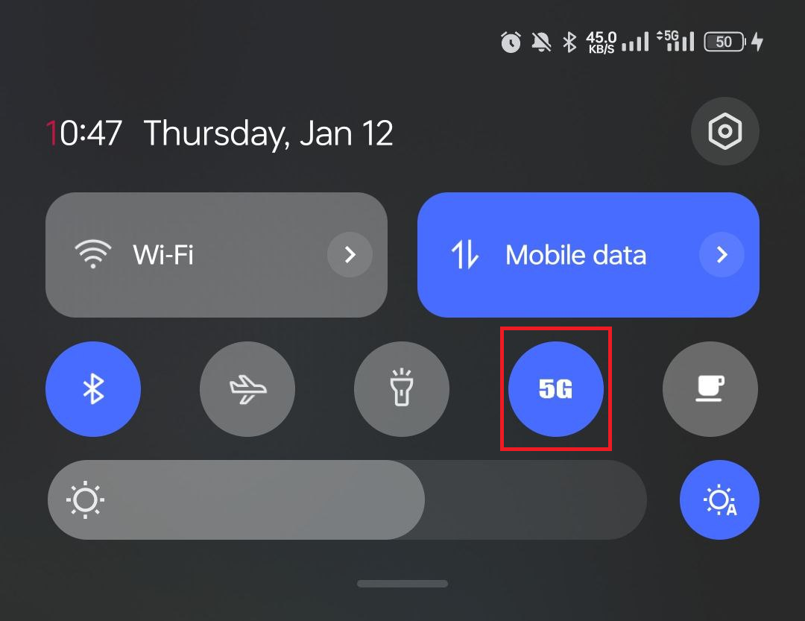

# FivegTile

[中文版](README_zh-rCN.md)

Toggle 5G with a single tap in quick settings

## Compatibility

- Android 11+
- **Root permission is needed**.

## Why

Well, this should have been done by OEMs and some of them actually had this feature a few years ago. But unfortunately, they all get removed due to carrier policy. It's time to implement it on our own.

## Download

- [Releases](https://github.com/libxzr/FivegTile/releases)

## License

- [MIT](LICENSE)
